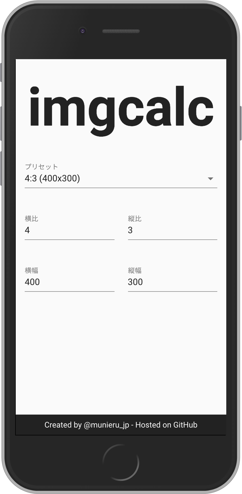

[](https://app.netlify.com/sites/imgcalc/deploys)

# imgcalc
Tool for calculating image size from aspect ratio



## Development
### Install packages
```sh
$ npm i
```

or

```sh
$ yarn install
```

### Create config file
```sh
$ cp config.sample.json config.json
```

Input below values to `config.json`:

|key|description|example|
|---|---|---|
|`BASE_DIR`|base directory to deploy|`/`|
|`TWITTER_ID`|Twitter ID|`munieru_jp`|
|`OG_IMAGE_PATH`|OGP image path|`favicon-256x256.png`|
|`ORIGIN`|origin to deploy|`http://localhost:3000/`|
